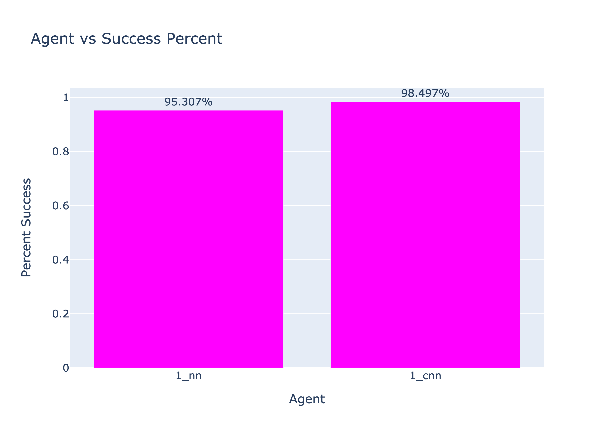
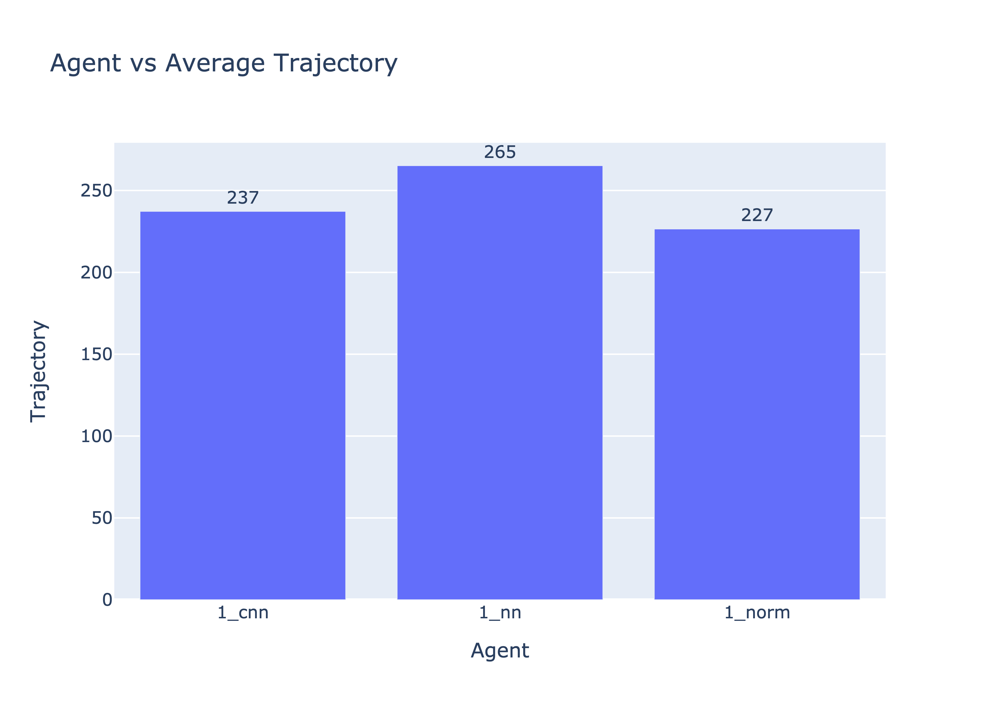
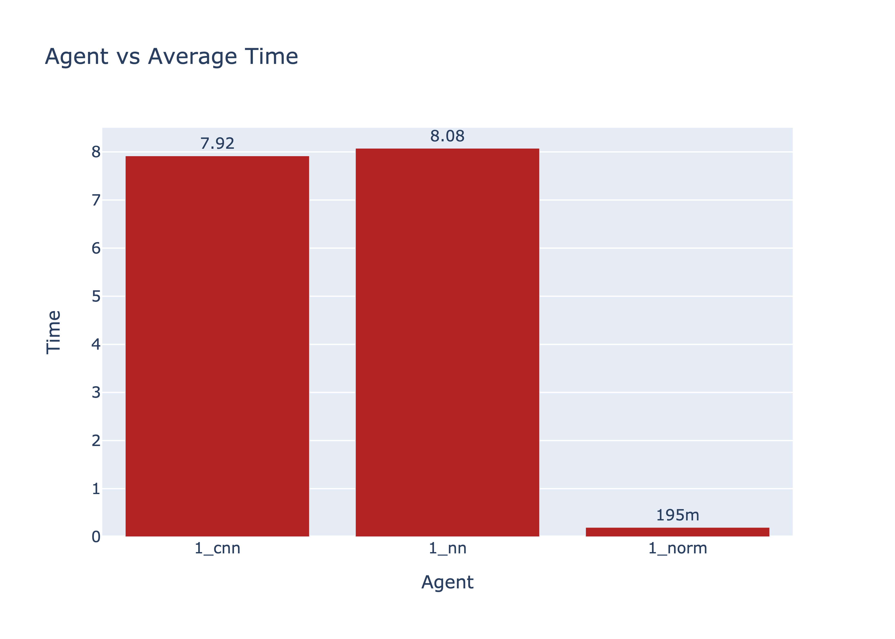
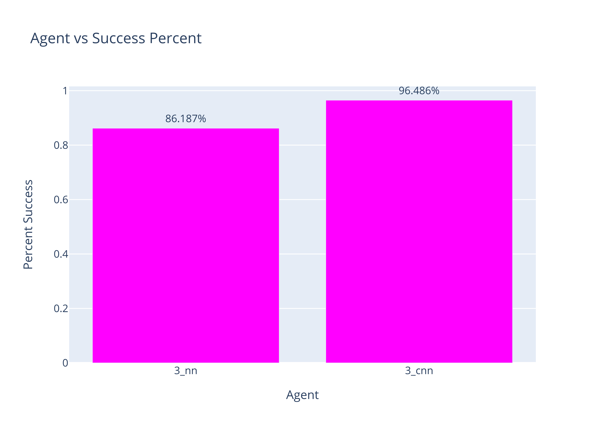
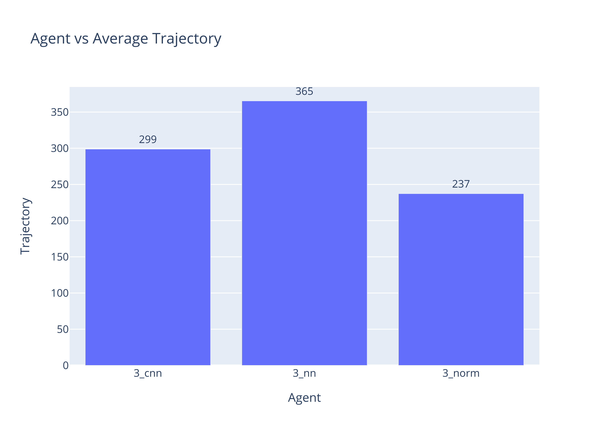
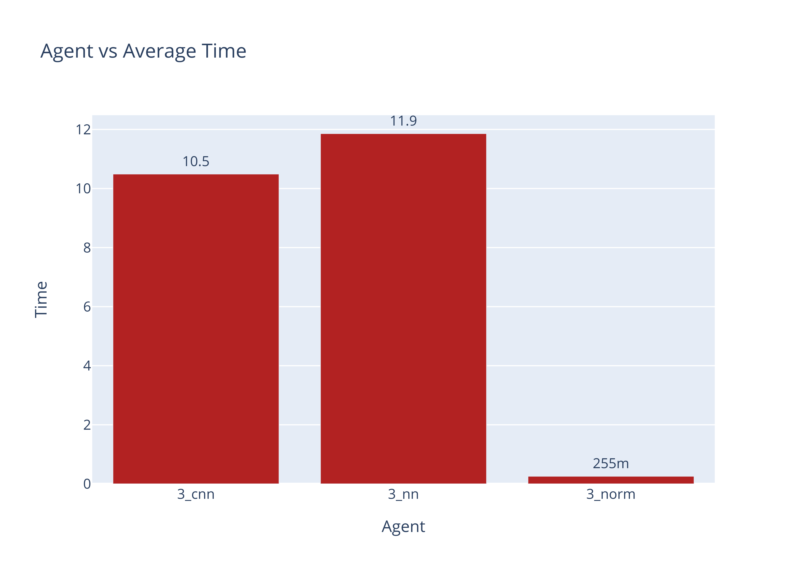

# Imitation Game
### Advith Chegu (ac1771) & Naveenan Yogeswaran (nry7)
### Both group members contributed equally to the code, data collection, and report.

## Project 1: Archtecture 1
**1) How  should  the  state  space  (current  information)  and  action  space  (action  selected)  be  represented  for  the model?  How does it capture the relevant information, in a relevant way, for your model space? One thing toconsider here is local vs global information.**

In this architecture we represent the current state space with three arrays. The first of this array is the current discovered gridworld. This gridworld is similar to the one that the original agent uses. This gridworld is a dim x dim array that contains the numbers 0, 1, and 2. 0 is used to represent a known unblocked cell in the grid, 1, is used to represent a known block cell in the grid, and 2 is used to represent an assumed unblocked cell. This array is important to our state space as it captures the current information that the agent has on the grid (which cells are blocked, etc.) This helps the neural network learn which cells to avoid going and what direction to go to as the neural network will be trained to use this array to learn to avoid block cells and to mimic the behavior of A* star which is to go down and right as possible.
The next array we use is an encoding of the position of the agent. This array is a dim x dim array that is full of 0s except for the position of the agent which is denoted with a 1. This array is used to represent where the agent is relative to the gridworld. This array is important as it shows the neural network where the agent is to help it decide which action to take. The idea is that the neural network can make a connection between this array and the discovered gridworld to decide which direction is best to avoid blocks.
Next, we pass a more local 5 x 5 grid that captures the surroundings of the agent. The values in this board contain the number of times each cell was visited with block cells and out of boundary cells being represented with a number that is relatively larger. We use this information to help the agent draw better connections on which cells to avoid in order to prevent the agent from repeatedly hitting the same block and repeatedly trying to go out of bounds. The use of this local information, rather than just the global information, improved our accuracy and made the agent better at detecting which blocks to avoid.
Finally, we used an array to represent the action that needed to be taken. We do this with encoding. So the direction left is represented by a 1 in the 0th index, the direction up is represented by a 1 in the 1st index, the direction right is represented by a 1 in the 2nd index, and the direction down is represented by a 1 in the 3rd index. We use one hot encoding rather than numbers as we treated this as a classification problem and we wanted to avoid the neural network from assuming there is an order to these outputs. 

**2)  How are you defining your loss function when training your model?**

We defined the loss function for our training to be categorical cross entropy loss function. We chose to use this as our loss function as we treated this problem as a classification problem where given the input, we wanted the neural network to classify this as a state that required either going left, up, right, or down with probabilities. We wanted to make this loss function cross entropy as we represented our output as a one hot encoding array. As a result, categorical cross entropy was the ideal loss function for our purposes.

Placeholder

**4)  How did you avoid overfitting?  Since you want the ML agent to mimic the original agent, should you avoid overfitting?**

One important step we took to avoid overfitting was monitoring our training accuracy and validation accuracy when experimenting with different parameters and architectures. We do this by having tensorflow report these statistics after every epoch. We ensured that our training accuracy isn’t significantly higher than our validation accuracy as that would indicate overfitting on the training data. Another step we took to avoid overfitting was by reducing the number of epochs we used. We found that using many epochs may cause our model to begin overfitting so we tried to rely on more data rather than more epochs. To determine the right number of epochs, we monitored the training accuracy and the validation accuracy to see at what epoch does the training tend to have very similar training accuracy and validation accuracy. Another step we took to reduce overfitting was to try to keep our model as simple as possible by using as few layers and nodes as needed while keeping our model accuracy high. We did this because we wanted to avoid our model from learning too much about the training data (with it’s more complex structure) to the point where it doesn’t generalize outside the training data as well. Since we want the ML agent to mimic the original agent, we should avoid overfitting as we want the ML agent to be able to generalize outside of the training data. If we had overfitting, the ML agent will struggle to adapt to new environments and inputs outside of the training data which is not ideal. 

**5)  How did you explore the architecture space, and test the different possibilities to find the best architecture?**

When exploring the architecture space, our goal was to keep the network as simple as possible and to have the number of nodes gradually decrease to 4 nodes. We first started with a large and complex network with an initial layer that had a similar amount of nodes as parameters. We then decreased the number of nodes with each layer by a factor of two and trained our model to see our training accuracy and test accuracy. The reason we wanted to decrease the number of nodes per layer is so we can gradually reduce our results to 4 nodes, each node representing one direction. We also added a softmax layer at the end to get probabilities of each direction that sums to 1.
When we got an accuracy we were satisfied with, we began to simplify the network while maintaining the training accuracy. We wanted to simplify the network as much as possible to prevent any potential overfitting and to try to reduce the amount of time spent in the network. To do this, we gradually removed layers and the number nodes, and we trained the model on the same set of data. Eventually, we got an architecture that wasn’t too complex and was able to predict the direction with high accuracy and validation. We ended with a model that had a layer of 100 nodes, a layer of 64 nodes, a layer of 16 nodes, a layer of 4 nodes, and a softmax layer.

**6)  Do you think increasing the size or complexity of your model would offer any improvements?  Why or why not?**

No, we do not believe increasing the size or complexity of our model will offer any improvements. Our current model is already able to predict the direction with high accuracy and so we want to avoid making the model even more complex in order to avoid the potential side effects of doing so. The main issue we wanted to avoid was overfitting our model to the training data as we want our model to generalize well. This is also one of the reasons why we aimed for a simple model when exploring the architecture space.

**7)  Does good performance on test data correlate with good performance in practice?  Simulate the performance of your ML agent on new gridworlds to evaluate this.**

```
Gridworld
[0, 1, 0, 0, 1, 0, 1, 0, 0, 1]
[0, 0, 0, 0, 0, 0, 0, 0, 0, 1]
[1, 0, 1, 0, 0, 1, 0, 0, 1, 0]
[0, 0, 1, 0, 0, 0, 1, 1, 1, 0]
[0, 0, 0, 0, 0, 1, 0, 0, 0, 1]
[0, 1, 0, 0, 1, 0, 1, 1, 0, 0]
[1, 0, 1, 0, 0, 0, 0, 0, 0, 0]
[0, 0, 0, 0, 0, 0, 1, 1, 0, 1]
[1, 1, 0, 0, 0, 0, 1, 1, 0, 1]
[0, 0, 0, 0, 1, 1, 0, 0, 0, 0]
```

Agents Paths:
1 means the agent visited that cell
0 means the agent didn't visit the cell

```
Original Agent Map on a 10x10 Example
[1, 0, 0, 0, 0, 0, 0, 0, 0, 0]
[1, 1, 0, 0, 0, 0, 0, 0, 0, 0]
[0, 1, 0, 0, 0, 0, 0, 0, 0, 0]
[0, 1, 0, 0, 0, 0, 0, 0, 0, 0]
[0, 1, 1, 0, 0, 0, 0, 0, 0, 0]
[0, 0, 1, 1, 0, 0, 0, 0, 0, 0]
[0, 0, 0, 1, 0, 1, 1, 1, 1, 0]
[0, 0, 0, 1, 0, 1, 0, 0, 1, 0]
[0, 0, 0, 1, 1, 1, 0, 0, 1, 0]
[0, 0, 0, 1, 0, 0, 0, 0, 1, 1]
```

```
Project 1: Architecture 1 Agent Map on same 10x10 Example
[1, 0, 0, 0, 0, 0, 0, 0, 0, 0]
[1, 1, 0, 0, 0, 0, 0, 0, 0, 0]
[0, 1, 0, 0, 0, 0, 0, 0, 0, 0]
[0, 1, 0, 0, 0, 0, 0, 0, 0, 0]
[0, 1, 1, 0, 0, 0, 0, 0, 0, 0]
[0, 0, 1, 1, 0, 0, 0, 0, 0, 0]
[0, 0, 0, 1, 0, 1, 1, 1, 1, 0]
[0, 0, 0, 1, 0, 1, 0, 0, 1, 0]
[0, 0, 0, 1, 1, 1, 0, 0, 1, 0]
[0, 0, 0, 1, 0, 0, 0, 0, 1, 1]
```

```
Project 1: Architecture 2 Agent Map on same 10x10 Example
[1, 0, 0, 0, 0, 0, 0, 0, 0, 0]
[1, 1, 0, 0, 0, 0, 0, 0, 0, 0]
[0, 1, 0, 0, 0, 0, 0, 0, 0, 0]
[0, 1, 0, 0, 0, 0, 0, 0, 0, 0]
[0, 1, 1, 0, 0, 0, 0, 0, 0, 0]
[0, 0, 1, 1, 0, 0, 0, 0, 0, 0]
[0, 0, 0, 1, 0, 1, 1, 1, 1, 0]
[0, 0, 0, 1, 0, 1, 0, 0, 1, 0]
[0, 0, 0, 1, 1, 1, 0, 0, 1, 0]
[0, 0, 0, 1, 0, 0, 0, 0, 1, 1]
```

Based off the data above, it appears that our agents were able to successfully mimic the original agent in this example 10x10 grid.

In this particular case, our agents validation accuracy were in the high 90s so it does appear that good performance on test data does correlate with good performance in practice. However, it should be noted that this may not always be the case. For example, there may occasionaly be times where the ML agents (despite having good test performance) may get stuck in a deadend while the original agent is able to leave. Although this example doesn't show this, is a possible case that shows that good performance on test data may not always correlate with good performance in practice.

**8)  For your best model structure, for each architecture, plot a) performance on test data as a function of trainingrounds, and b) average performance in practice on new gridworlds.  How do your ML agents stack up against the original agents?  Do either ML agents offer an advantage in terms of training time?**

Key:
NN Agent refers to Project 1: Architecture 1
CNN Agent refers to Project 1: Architecture 2


Based off the graph above, we can see that the NN Agent gradually increases in accuracy until it flattens at around 6 epochs.



As seen in this graph, our NN Agent was able to solve at least 95% of the 3000 50x50 grids we ran it against. We noticed that a common case of failure for this agent is if it encounters a deadend and is unable to get out of the deadend. However, based off these results, our NN agent was still able to solve 95% of the grids that the original agent solved.
Compared to the CNN Agent (which solves 98.5% of grids), our NN Agent wasn't able to solve as many grids. However, when considering the training time of these agents, it can be argued that one agent offers an advantage in terms of training time depending on the machine you train on. If a GPU isn't present when training, the CNN Agents takes more time to train compared to the NN Agent. Because we see a 3% improvement, it can be argued that the NN agent offers more of an advantage. However, when training with a GPU, the CNN agent is able to train just as fast as the NN agent, and so in this scenario, the CNN agent offers an advantage.



As seen in this graph, our NN Agent performs relatively worse than the CNN agent and the original agent. On average, the NN Agent take 28 more steps than the CNN agent and 38 more steps than the original agent. The NN agent is likely not able to perform as good as the original agent because it is just attempting to mimic the original agent while also being more prone to hitting blocks and slowly getting out of deadends compared to the original agent.
In this case, the CNN agent may offer an advantage in terms of training time, whether you're training with a GPU or not, as there is a noticeable difference in the optimality of the paths taken by the CNN agent compared to the NN agent.



As seen in this graph, our NN agent performed worse than the CNN agent and the original agent. This likely due to our repeated calls to the neural network each step which may have likely slowed down the agent and due to the slightly larger trajectories of the NN agent.
In this case, the NN agent may offer an advantage in terms of training time when training without a GPU as there isn't a noticeable difference between the average time taken in the NN agent and the CNN agent. However, when training on a GPU, the CNN agent will be a better choice.

Overall, our NN agent performs slightly worse in terms of solvability and trajectory, and significantly worse in terms of time. This was expected as the goal of the neural network was to mimic the original agent, however, it is difficult to train the neural network to absolutely mimic the original agent. 

Regarding advantages in terms of training, this could depend on whether you're training with or without a GPU. With a GPU, the CNN is a better choice as it trains almost just as fast and performs better in every metric compared to the NN. Without a GPU, it is up to the user to decide whether a longer training time is worth the improvement in trajectories.


## Project 1: Archtecture 2
**1)  How  should  the  state  space  (current  information)  and  action  space  (action  selected)  be  represented  for  the model?  How does it capture the relevant information, in a relevant way, for your model space? One thing toconsider here is local vs global information.**

This architecure uses the same representations and for the same reasons as Project 1 Architecture 1.

**2)  How are you defining your loss function when training your model?**

This architecure uses the same loss function and for the same reasons as Project 1 Architecture 1.

Placeholder

**4)  How did you avoid overfitting?  Since you want the ML agent to mimic the original agent, should you avoid overfitting?**

We used the same methods to prevent overfitting in this architecture as we did in Project 1 Architecture 1. We also wanted to avoid overfitting for the same reasons.

**5)  How did you explore the architecture space, and test the different possibilities to find the best architecture?**

Similar to the Project 1 Architecture 1, when exploring the architecture space, our goal was to keep the network as simple as possible and to have the number of nodes gradually decrease to 4 nodes. We first started with a large and complex network. The inital layer of this network is a convultional layer for each input. For the convolutional layer for the discovered grid input, we used a convlutional layer that consisted of a window size of 5x5, a stride of 1, and 4 features. We decided to use a windows size of 5x5 as we wanted a field of view that is similar to our local information input. By having a window size of 5x5, we believe this captures the local features of the grid well enough. We set the stride to be 1 as we wanted to shift this window by one. Lastly, we set the features to 4 in order to hope that the neural network can learn the structure of the grid as well as the distinctions of 0, 1, and 2. For the convulitional layer for the position encoding input, we repeat the use of a 5x5 window with a stride of 1, however we only detect 2 features as there isn't too much that is happening in this grid. Lastly, we have the convultional layer of the local information input where we set the window to be 3x3, the stride to be 1, and the features to be 3. We decided on a smaller window as the local information is only 5x5 and so locally defined features will likely be found in a smaller window of 3x3. We chose to use 3 features after testing as we want the neural network to be able to learn to move towards smaller values among this local information. 
We then decreased the number of nodes with each dense layer by a factor of two and trained our model to see our training accuracy and test accuracy. The reason we wanted to decrease the number of nodes per layer is so we can gradually reduce our results to 4 nodes, each node representing one direction. We also added a softmax layer at the end to get probabilities of each direction that sums to 1. 
When we got an accuracy we were satisfied with, we began to simplify the network while maintaining the training accuracy. We wanted to simplify the network as much as possible to prevent any potential overfitting and to try to reduce the amount of time spent in the network. To do this, we gradually removed dense layers and the number nodes, and we trained the model on the same set of data. Eventually, we got an architecture that wasn’t too complex and was able to predict the direction with high accuracy and validation. We ended with a model that had a convolutional layer of each input, a layer of 100 nodes, a layer of 64 nodes, a layer of 4 nodes, and a softmax layer.

**6)  Do you think increasing the size or complexity of your model would offer any improvements?  Why or why not?**
We don't believe incrasing the size or complexity of our model would offer any improvements for the same reasons as in Project 1 Architecture 1.

**7)  Does good performance on test data correlate with good performance in practice?  Simulate the performance of your ML agent on new gridworlds to evaluate this.**

Please refer to Project 1: Architecture 1 Question 7.

**8)  For your best model structure, for each architecture, plot a) performance on test data as a function of trainingrounds, and b) average performance in practice on new gridworlds.  How do your ML agents stack up against the original agents?  Do either ML agents offer an advantage in terms of training time?**

Key:
NN Agent refers to Project 1: Architecture 1
CNN Agent refers to Project 1: Architecture 2


Based off the graph above, we can see that the CNN Agent sharply increases in accuracy in the second epoch and it peaks around 5 epochs before flattening.


As seen in this graph, the CNN Agent was able to solve around 98.5% of the 3000 50x50 grids we generated. This makes the CNN agent close to as good at solving grids as the original agent. Although it solves more grids than the NN agent, it does seem to still suffer from failure cases including problems with escaping deadends.
For an evaluation of NN vs CNN in terms of training for solvability, refer to Project 1: Architecture 1 Question 8.


As seen in this graph, the CNN Agent was able to perform significantly better than the NN agent and only slightly worse than the original agent. Similar to the NN agent, the reason for the slightly worse trajectory compared to the original agent may be due to hitting more blocks and getting out of deadends slowly.
For an evaluation of NN vs CNN in terms of training for performance, refer to Project 1: Architecture 1 Question 8.


As seen in this graph, the CNN Agent performed worse than the original agent in terms of time. Like the NN agent, this is likely due to the repeated calls to the CNN each step which slows the agent down.
For an evaluation of NN vs CNN in terms of training for time, refer to Project 1: Architecture 1 Question 8.

For an evaluation of NN and CNN compared to the original agent and final evaluation of NN vs CNN in terms of training overall, refer to Project 1: Architecture 1 Question 8.

## Project 2: Archtecture 1
**1) How  should  the  state  space  (current  information)  and  action  space  (action  selected)  be  represented  for  the model?  How does it capture the relevant information, in a relevant way, for your model space? One thing toconsider here is local vs global information.**

In addition to the discovered gridworld, position encoding, and the local information that was used in Project 1 Architecture 1 and 2, we also used a sense array as part of our state space. This sense array is a dim x dim array where each position represents the number of neighbors that were sensed to be blocked in that cell. If the agent hadn't sensed at that position yet, the value will be -1. We use this array as part of our state space so the neural network can make connections between the discovered gridworld and the sensed neighbors grid to make inferences about the neighbors of the cell's current position. 
The reasons we use the discovered gridworld, position encoding, and the local information as part of our state space is the same as those in Project 1 Architecture 1 and 2 agents.
The reason we used a one hot encoding that represent direction for the action space is the same as that in Project 1 Architecture 1 and 2 agents.

It should be noted that due to time constraints, we had to use manual inferences as suggested in office hours.

**2)  How are you defining your loss function when training your model?**

This architecure uses the same loss function and for the same reasons as Project 1 Architecture 1 and 2.

Placeholder

**4)  How did you avoid overfitting?  Since you want the ML agent to mimic the original agent, should you avoid overfitting?**

We used the same methods to prevent overfitting in this architecture as we did in Project 1 Architecture 1 and 2. We also wanted to avoid overfitting for the same reasons.

**5)  How did you explore the architecture space, and test the different possibilities to find the best architecture?**

Similar to our Project 1 Architecture 1 agent, when exploring the architecture space, our goal was to keep the network as simple as possible and to have the number of nodes gradually decrease to 4 nodes. We first started with a large and complex network with an initial layer that had a similar amount of nodes as parameters. We then decreased the number of nodes with each layer by a factor of two and trained our model to see our training accuracy and test accuracy. The reason we wanted to decrease the number of nodes per layer is so we can gradually reduce our results to 4 nodes, each node representing one direction. We also added a softmax layer at the end to get probabilities of each direction that sums to 1.
When we got an accuracy we were satisfied with, we began to simplify the network while maintaining the training accuracy. We wanted to simplify the network as much as possible to prevent any potential overfitting and to try to reduce the amount of time spent in the network. To do this, we gradually removed layers and the number nodes, and we trained the model on the same set of data. Eventually, we got an architecture that wasn’t too complex and was able to predict the direction with high accuracy and validation. We ended with a model that had a layer of 100 nodes, a layer of 64 nodes, a layer of 16 nodes, a layer of 4 nodes, and a softmax layer.

**6)  Do you think increasing the size or complexity of your model would offer any improvements?  Why or why not?**

We don't believe incrasing the size or complexity of our model would offer any improvements for the same reasons as in Project 1 Architecture 1.

**7)  Does good performance on test data correlate with good performance in practice?  Simulate the performance of your ML agent on new gridworlds to evaluate this.**

```
Gridworld
[0, 0, 1, 1, 0, 1, 0, 0, 0, 1]
[0, 0, 1, 0, 0, 0, 1, 0, 0, 0]
[1, 0, 0, 1, 1, 0, 0, 0, 0, 0]
[0, 1, 0, 0, 1, 0, 1, 0, 1, 0]
[1, 0, 0, 0, 0, 0, 1, 0, 1, 0]
[0, 0, 1, 0, 0, 0, 1, 1, 0, 1]
[0, 0, 0, 0, 0, 0, 0, 0, 0, 1]
[1, 0, 0, 0, 0, 0, 1, 0, 0, 0]
[0, 1, 1, 0, 1, 0, 0, 1, 0, 0]
[0, 0, 0, 1, 1, 0, 1, 0, 0, 0]
```

Agents Paths:
1 means the agent visited that cell
0 means the agent didn't visit the cell

```
Original Agent Map on a 10x10 Example
[1, 0, 0, 0, 0, 0, 0, 0, 0, 0]
[1, 1, 0, 0, 0, 0, 0, 0, 0, 0]
[0, 1, 1, 0, 0, 0, 0, 0, 0, 0]
[0, 0, 1, 0, 0, 0, 0, 0, 0, 0]
[0, 0, 1, 1, 0, 0, 0, 0, 0, 0]
[0, 0, 0, 1, 0, 0, 0, 0, 0, 0]
[0, 0, 0, 1, 0, 1, 1, 1, 0, 0]
[0, 0, 0, 1, 1, 1, 0, 1, 1, 0]
[0, 0, 0, 1, 0, 1, 1, 0, 1, 0]
[0, 0, 0, 0, 0, 1, 0, 0, 1, 1]
```

```
Project 2: Architecture 1 Agent Map on same 10x10 Example
[1, 0, 0, 0, 0, 0, 0, 0, 0, 0]
[1, 1, 0, 0, 0, 0, 0, 0, 0, 0]
[0, 1, 1, 0, 0, 0, 0, 0, 0, 0]
[0, 0, 1, 0, 0, 0, 0, 0, 0, 0]
[0, 0, 1, 1, 0, 0, 0, 0, 0, 0]
[0, 0, 0, 1, 0, 0, 0, 0, 0, 0]
[0, 0, 0, 1, 0, 1, 1, 1, 0, 0]
[0, 0, 0, 1, 1, 1, 0, 1, 1, 0]
[0, 0, 0, 1, 0, 1, 1, 0, 1, 0]
[0, 0, 0, 0, 0, 1, 0, 0, 1, 1]
```

```
Project 2: Architecture 2 Agent Map on same 10x10 Example
[1, 0, 0, 0, 0, 0, 0, 0, 0, 0]
[1, 1, 0, 0, 0, 0, 0, 0, 0, 0]
[0, 1, 1, 0, 0, 0, 0, 0, 0, 0]
[0, 0, 1, 0, 0, 0, 0, 0, 0, 0]
[0, 0, 1, 1, 0, 0, 0, 0, 0, 0]
[0, 0, 0, 1, 0, 0, 0, 0, 0, 0]
[0, 0, 0, 1, 0, 1, 1, 1, 0, 0]
[0, 0, 0, 1, 1, 1, 0, 1, 1, 0]
[0, 0, 0, 1, 0, 1, 1, 0, 1, 0]
[0, 0, 0, 0, 0, 1, 0, 0, 1, 1]
```

Based off the data above, it appears that our agents were able to successfully mimic the original agent in this example 10x10 grid.

In this particular case, our agents validation accuracy were in the high 90s so it does appear that good performance on test data does correlate with good performance in practice. However, it should be noted that this may not always be the case. For example, there may occasionaly be times where the ML agents (despite having good test performance) may get stuck in a deadend while the original agent is able to leave. Although this example doesn't show this, is a possible case that shows that good performance on test data may not always correlate with good performance in practice.

**8)  For your best model structure, for each architecture, plot a) performance on test data as a function of training rounds, and b) average performance in practice on new gridworlds.  How do your ML agents stack up against the original agents?  Do either ML agents offer an advantage in terms of training time?**

Key:
NN Agent refers to Project 2: Architecture 1
CNN Agent refers to Project 2: Architecture 2


Based off the graph above, we can see that the NN Agent gradually increases in accuracy until it decreases at around 5 epochs. It begins to increase again afterwards.



As seen in this graph, our NN Agent was able to solve at least 86% of the 3000 50x50 grids we ran it against. We noticed that a common case of failure for this agent is if it encounters a deadend and is unable to get out of the deadend. However, based off these results, our NN agent was still able to solve 86% of the grids that the original agent solved.
Compared to the CNN Agent (which solves 96.5% of grids), our NN Agent wasn't able to solve as many grids. When considering the training time of these agents, it appears that the CNN Agent offers an advantage as it was able to solve a significant more number of grids which is worthwhile to have even if you're training without a GPU (where the CNN agent appears takes longer to train).



As seen in this graph, our NN Agent performs worse than the CNN agent and the original agent. On average, the NN Agent take 66 more steps than the CNN agent and 128 more steps than the original agent. The NN agent is likely not able to perform as good as the original agent because it is just attempting to mimic the original agent while also being more prone to hitting blocks and slowly getting out of deadends compared to the original agent.
In this case, the CNN agent still offers an advantage in terms of training time, whether you're training with a GPU or not, as there is a significant difference in the optimality of the paths taken by the CNN agent compared to the NN agent.



As seen in this graph, our NN agent performed worse than the CNN agent and the original agent. This likely due to our repeated calls to the neural network each step which may have likely slowed down the agent and due to the slightly larger trajectories of the NN agent.
In this case, the NN agent may offer an advantage in terms of training time when training without a GPU as there isn't a noticeable difference between the average time taken in the NN agent and the CNN agent. However, when training on a GPU, the CNN agent will be a better choice.

Overall, our NN agent performs worse in terms of solvability and trajectory, and significantly worse in terms of time. This was expected as the goal of the neural network was to mimic the original agent, however, it is difficult to train the neural network to absolutely mimic the original agent. 

Regarding advantages in terms of training, the CNN agent offers more advantages, whether you're training with a GPU or not, as the improvements in solvability and optimality are signifcant despite the training time difference if training without a GPU.

## Project 2: Archtecture 2
**1) How  should  the  state  space  (current  information)  and  action  space  (action  selected)  be  represented  for  the model?  How does it capture the relevant information, in a relevant way, for your model space? One thing toconsider here is local vs global information.**

This architecure uses the same representations and for the same reasons as Project 2 Architecture 1.

**2)  How are you defining your loss function when training your model?**

This architecure uses the same loss function and for the same reasons as Project 1 Architecture 1 and 2.

Placeholder

**4)  How did you avoid overfitting?  Since you want the ML agent to mimic the original agent, should you avoid overfitting?**

We used the same methods to prevent overfitting in this architecture as we did in Project 1 Architecture 1 and 2. We also wanted to avoid overfitting for the same reasons.

**5)  How did you explore the architecture space, and test the different possibilities to find the best architecture?**

Similar to the Project 1 Architecture 2, when exploring the architecture space, our goal was to keep the network as simple as possible and to have the number of nodes gradually decrease to 4 nodes. We first started with a large and complex network. The inital layer of this network is a convultional layer for each input. For the convolutional layer for the discovered grid input, we used a convlutional layer that consisted of a window size of 5x5, a stride of 1, and 4 features. We decided to use a windows size of 5x5 as we wanted a field of view that is similar to our local information input. By having a window size of 5x5, we believe this captures the local features of the grid well enough. We set the stride to be 1 as we wanted to shift this window by one. Lastly, we set the features to 4 in order to hope that the neural network can learn the structure of the grid as well as the distinctions of 0, 1, and 2. For the convulitional layer for the position encoding input, we repeat the use of a 5x5 window with a stride of 1, however we only detect 2 features as there isn't too much that is happening in this grid. Lastly, we have the convultional layer of the local information input where we set the window to be 3x3, the stride to be 1, and the features to be 3. We decided on a smaller window as the local information is only 5x5 and so locally defined features will likely be found in a smaller window of 3x3. We chose to use 3 features after testing as we want the neural network to be able to learn to move towards smaller values among this local information. 
Additionally for this agent in particular, we decided to also use a convolutional layer for the sensed neighbors input. This layer uses a window size of 5x5 and a stride of 1 for similar reasons as the discovered gridworld and the position encoding. We use 8 features for this layers as there are 8 possible values and we'd like the neural network to try to identifty the structure of these values.
We then decreased the number of nodes with each dense layer by a factor of two and trained our model to see our training accuracy and test accuracy. The reason we wanted to decrease the number of nodes per layer is so we can gradually reduce our results to 4 nodes, each node representing one direction. We also added a softmax layer at the end to get probabilities of each direction that sums to 1. 
When we got an accuracy we were satisfied with, we began to simplify the network while maintaining the training accuracy. We wanted to simplify the network as much as possible to prevent any potential overfitting and to try to reduce the amount of time spent in the network. To do this, we gradually removed dense layers and the number nodes, and we trained the model on the same set of data. Eventually, we got an architecture that wasn’t too complex and was able to predict the direction with high accuracy and validation. We ended with a model that had a convolutional layer of each input, a layer of 100 nodes, a layer of 64 nodes, a layer of 4 nodes, and a softmax layer.

**6)  Do you think increasing the size or complexity of your model would offer any improvements?  Why or why not?**

We don't believe incrasing the size or complexity of our model would offer any improvements for the same reasons as in Project 1 Architecture 1.

**7)  Does good performance on test data correlate with good performance in practice?  Simulate the performance of your ML agent on new gridworlds to evaluate this.**

Please refer to Project 2: Architecture 1 Question 7.

**8)  For your best model structure, for each architecture, plot a) performance on test data as a function of trainingrounds, and b) average performance in practice on new gridworlds.  How do your ML agents stack up against the original agents?  Do either ML agents offer an advantage in terms of training time?**

Key:
NN Agent refers to Project 2: Architecture 1
CNN Agent refers to Project 2: Architecture 2


Based off the graph above, we can see that the CNN Agent gradually increases in accuracy until it decreases at around 7 epochs, possibly from overfitting.


As seen in this graph, the CNN Agent was able to solve around 96.5% of the 3000 50x50 grids we generated. This makes the CNN agent close to as good at solving grids as the original agent. Although it solves more grids than the NN agent, it does seem to still suffer from failure cases including problems with escaping deadends.
For an evaluation of NN vs CNN in terms of training for solvability, refer to Project 2: Architecture 1 Question 8.


As seen in this graph, the CNN Agent was able to perform significantly better than the NN agent, but still worse than the original agent. Similar to the NN agent, the reason for the slightly worse trajectory compared to the original agent may be due to hitting more blocks and getting out of deadends slowly.
For an evaluation of NN vs CNN in terms of training for performance, refer to Project 2: Architecture 1 Question 8.


As seen in this graph, the CNN Agent performed worse than the original agent in terms of time. Like the NN agent, this is likely due to the repeated calls to the CNN each step which slows the agent down.
For an evaluation of NN vs CNN in terms of training for time, refer to Project 2: Architecture 1 Question 8.

For an evaluation of NN and CNN compared to the original agent and final evaluation of NN vs CNN in terms of training overall, refer to Project 2: Architecture 1 Question 8.

